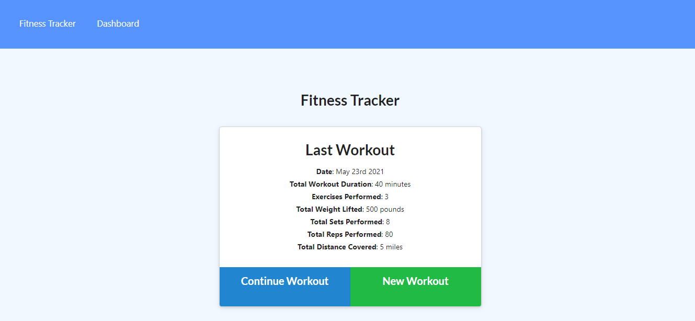
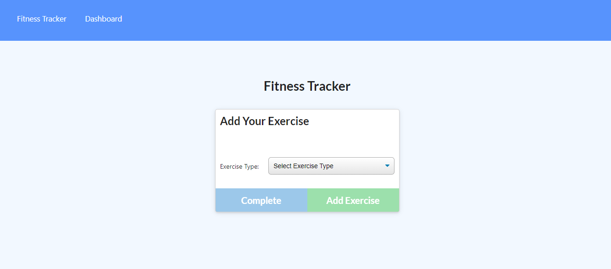
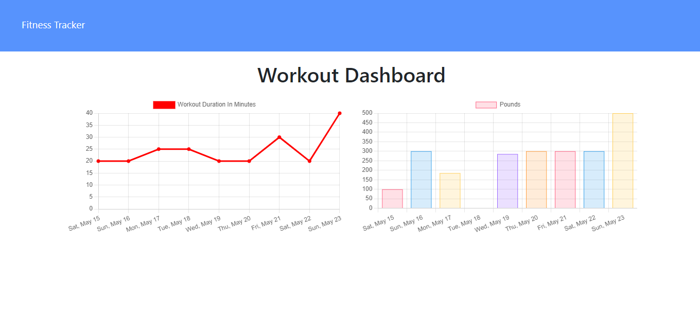

# Workout-Tracker
   

  ### Table of Contents 
  * [Descritption](#description)
  * [Installation](#installation)
  * [Usage](#usage)
  * [License](#license)
  * [Contribution](#contribution)
  * [Tests](#tests)
  * [Questions](#questions)
  undefined 

  ## Description
  This App allow user to Track the the workout on daily basis . 
  ## Installation
  The following necessary dependencies must be installed to run the application properly: For this application to run correctly on your local machine, run npm init -y in the working directory and installing required dependencies by running npm i Then for setting up Database command mongod is run on the command line and mongo command is run on seperate window command line .
  
  [Back to Top](#table-of-contents)

  ## Usage
  In order to use this app, run npm start cammand in the terminal for this application runs locally at port 3001 and make sure mongo is already running .
  note  run the command npm run seed to seed data to the database.
  
  A view of the home page:

  

  An view of adding an exercise/workout:

  

  A view of the dashboard:
  
  

  [Back to Top](#table-of-contents)
  
  ## Contribution
  Contributors: This project was a solo project .

  [Back to Top](#table-of-contents)

  ## Tests
  The following requirements to run the test: There are currently no tests written for this project.

  [Back to Top](#table-of-contents)
    

  ## Questions
  If you have any questions about this application my GitHub username is
   Github: [nishadkurup](github.com/nishadkurup) and you can view my GitHub profile at https://github.com/nishadkurup. 

  For any additional questions, feel free to reach out to me at Email:nishadkurup@gmail.com
